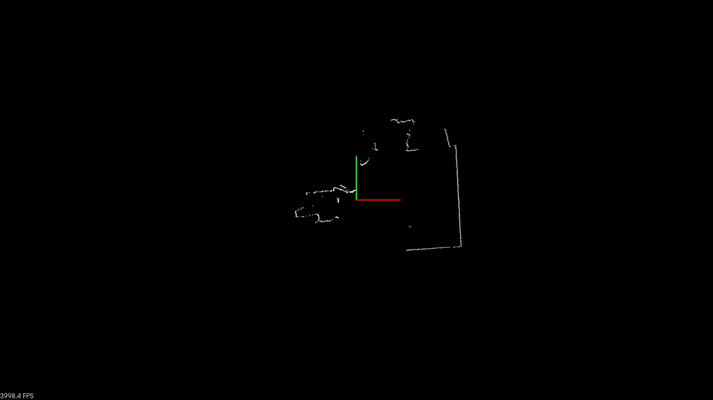

# pcl_tim_grabber
grabber class for SICK sensor named Tim.

# demo
<p align="center"></p>

# How to run demo
You can run this example on Linux.

Connect Tim5xx anyway.

Then run following commands.

```
$ apt install libpcl-dev
$ git clone https://github.com/ysuzuki19/pcl_sick_grabber
$ cd pcl_sick_grabber/example
$ mkdir build
$ cd build
$ cmake ..
$ make
$ ./project
```
# NOTE
Keep in mind that when connecting Tim5XX to your PC, set your PC's IP address to `192.168.0.X`(same LAN group)
